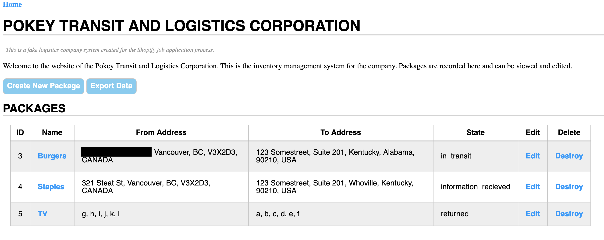

# Shopify Backend Developer Intern Challenge


*rust version coming soon*

This project is a simple inventory tracking application for a logistics company, as layed
out by the [Shopify Backend Developer Intern Challenge](https://docs.google.com/document/d/1z9LZ_kZBUbg-O2MhZVVSqTmvDko5IJWHtuFmIu_Xg1A/edit).

## Technologies
The whole thing is a Rails application built on Rails 7 with
a MySQL database. Main versions listed below:
- Rails 7.0.1
- Sqlite 3
- Node 16.13.0
- Yarn 1.22.10

## Running from Source
To run this project there are few prerequisites.

### Prerequisites
1. Make sure ruby 3.1.0 is installed. If you already have a version of Ruby installed, this can be done with `rbenv install 3.1.0`, if not, consult the Ruby website
1. Ensure sqlite is installed on your system. Many modern systems, such as macOS ship with this installed. Verify with `sqlite3 --version` or similar.
1. Node should be installed. This project was built using 16.13; your experience with other versions may vary. Verify with `node --version`
1. Yarn should be installed. Try `yarn --version`

The dependencies are essentially the base dependencies of any basic Rails-based application.

If all dependencies are installed, run:
```shell
$ bundle install
```

### Running
If everything is setup correctly, the following command should start the server.
```shell
$ bundle exec rails server
```
Then go to [localhost:3000](localhost:3000), and you should see the page running. Should look something like this:

There won't be any data or packages in the database when you first load, but you
can **create a package** by hitting "Create New Package". You can then 
**update a package** by hitting edit on the chart, and **destroy or delete it** by hitting the "Destroy" button. You can also **read the package** by clicking on its name in the table. These funcitons satisfy the CRUD requirements for the challenge.

For the challenge I also had to implement one of a list of features. The one I
chose was the ability to export data as CSV file, which you can do by hitting
the "Export Data" button.

That's hit. Best of luck.
